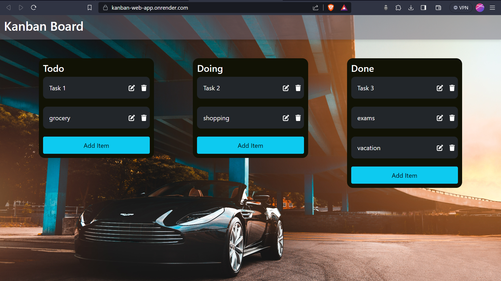
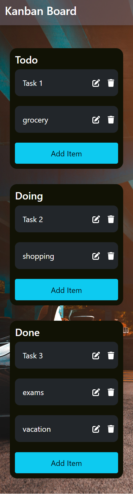

# Kanban-Task-Management-Web-App 

Kanban Board is a task management which allows people to organize things effectively and track tasks as todo, doing, done. 
Users can add tasks, edit tasks and also delete them in each section.
This web app is made responsive for mobile and desktop screens.
Users can seamlessly switch between mobile and desktop and still track their tasks.
All tasks are saved to database(so no worry in loosing the data).

## DEPLOYED LINK
[Deployed-website-link](https://kanban-web-app.onrender.com/)

## DESKTOP WEBSITE SCREENSHOT

## MOBILE WEBSITE SCREENSHOT

## TOOLS USED : 
FrontEnd : ReactJS, Bootstrap
BackEnd : NodeJS, ExpressJS
Database : MongodDB 
Deployment Tool : render 

### NOTE
This repository only features the frontend code and for backend I've created a separate respository. 

### BackEnd Repsository Link : 
[BackEnd-Repository-Link](https://github.com/vatsan-0613/kanban-backend)

